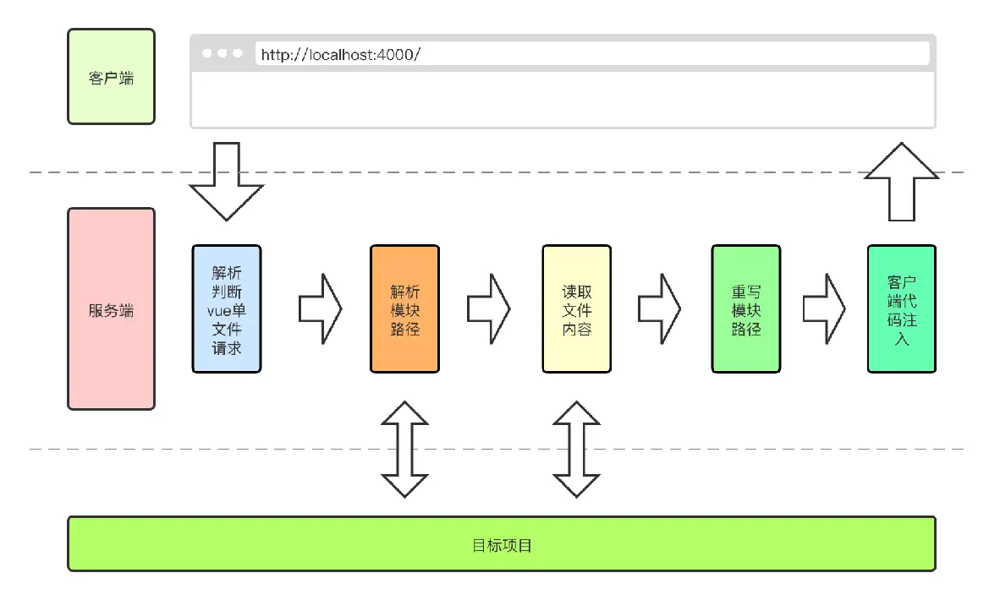

## vite是什么--(vite 中文文档)[https://cn.vitejs.dev/]
1. 是一个基于vue3单文件组件的非打包开发服务器。它做到了本地快速开发启动，实现按需编译，不再等待整个应用编译完成。
面向现代化浏览器，基于原生模块系统 ES moudle 的开发服务器，在服务器端按需编译返回，完全跳过了打包这个概念，服务器随起随用。

2. 启动项目时，则是启动一个koa服务器，服务器拦截浏览器的es module的请求，服务器直接将 ESM 模块内容处理后，通过 path 找到目录下对应的文件做一定的处理最终以 ES Modules 格式返回给客户端。接着，现代浏览器通过解析 script module，对每一个 import 到的模块进行 HTTP 请求，服务器继续对这些 HTTP 请求进行处理并响应。（热更新）

3. vite是以根目录下的index.html为入口，启动一个koa服务器，拦截浏览器的es module的请求，服务器直接将 ESM 模块内容处理后，通过 path 找到目录下对应的文件做一定的处理最终以 ES Modules 格式返回给客户端。接着，现代浏览器通过解析 script module，对每一个 import 到的模块进行 HTTP 请求，服务器继续对这些 HTTP 请求进行处理并响应。
4. vite天然支持ts,也就是vite内部可以直接对ts进行编译，不需要再单独安装ts，vite内部集成了ts-jest,它底层使用的是esbuild对ts进行编译，所以ts的编译速度非常快。
5. vite也对vue提供了支持,只需要安装对应的插件即可** @vitejs/plugin-vue **
6. 对CSS也支持了,不需要像webpack那样通过style-loader,css-loader,postcss-loader进行处理，vite内部还集成了postcss
```javaScript
/**
 * 这种导入方式，会把css注入页面
 * ?inline，不会注入页面，会把该css文件包装为一个模块导出
 */
import './css/style.css'
/**
 * css文件以.module.css为后缀名的会被认为是一个 CSS modules 文件。导入这样的文件会返回一个相应的模块对象：
 */
import styles from './css/test.module.css'
const divEl = document.createElement('div')
divEl.className=styles.title,
```
7.对静态资源的处理
* import.meta.url 是一个 ESM 的原生功能，会暴露当前模块的 URL。将它与原生的 URL 构造器 组合使用，在一个 JavaScript 模块中，通过相对路径我们就能得到一个被完整解析的静态资源 URL：
```javaScript
const imgUrl = new URL('./img/logo.png', import.meta.url).href

//导入一个静态资源会返回解析后的 URL：
import imgUrl from '../image.png'
const imgEl:HTMLImageElement = document.createElement('img')
imgEl.src = imgUrl
document.body.appendChild(imgEl)
//vite内部特殊的import.meta.glob 函数从文件系统导入多个【模块】：
const modules = import.meta.glob('./css/*.css')
for (const path in modules){
    console.log(modules[path]);//() => import("/src/css/style.css")是一个函数
    modules[path]().then(r=>{
        console.log(modules[path],r);
    })
}
```
## vite的安装
1. 安装vite
```
npm install -g create-vite-app
```
2. 创建项目
```
create-vite-app my-vue-app
```
3. 进入项目
```
cd my-vue-app
```
4. 启动项目
```
npm run dev
```
## vite的配置