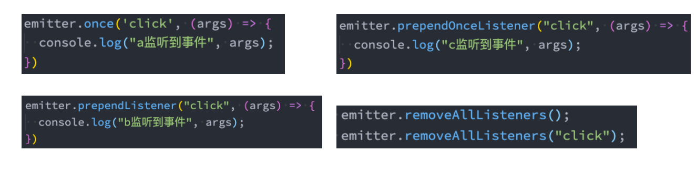

# Node.js中的Events模块
### 一、 Node中的核心API都是基于异步事件驱动的
* 在这个概念中，其实就是某些对象（Emitters类发射器）发出一个事件；
* 在某一地方我们就可以监听(Listenters监听器)这个时间，也以叫订阅这个事件，并且传入相应的回调函数，在见监听到这个时间的时间就会自动执行该回调函数
### 二、发出和监听事件都是通过EventEmitter类来完成
* 这个类就是属于Events对象；
* **const emitter = new EventEmitter()**,实例化这个类
* **emitter.on(eventName,listenter)**：用于监听事件，也可以使用addListener;
* **emiter.off(eventName,listenter)**:用于移除监听事件，也可以使用removeListener;
* **emitter.emit(eventName,[...args])** :发出事件，可以携带参数
```javascript
//引入events
const EventEmitter = require('events')
const emitter = new EventEmitter();//实例化
//监听事件
emitter.on('我曹', () => {
  console.log(`output->`, '我监听到了')
})
//发射事件
emitter.emit('我曹');//先订阅在发射，才能监听到
setTimeout(() => {
  emitter.emit('我曹')
}, 2000)
```
* 事件取消
```javascript
//引入events
const EventEmitter = require('events')
const emitter = new EventEmitter();//实例化
function Listenter () {
  console.log(`output->`, '我监听到了')
}
//监听事件
emitter.on('我曹', Listenter)
//发射事件
emitter.emit('我曹')
//取消事件
emitter.off('我曹', Listenter)
emitter.emit('我曹')//此时再出发没用了,因为已经调用了Off
```
### 三、其他常见的方法
* emitter.eventNames()，返回当前EventsEmiter的所有监听事件的事件名数组
* emitter.getMaxListeners()：返回当前 EventEmitter对象的最大监听器数量，可以通过setMaxListeners()来修改，默认是10
* emitter.listenerCount(事件名称)：返回当前 EventEmitter对象**个事件名称**的监听器个数
* emitter.listeners(事件名称)：返回当前 EventEmitter对象某个事件监听器上所有的回调函数的数组；
```javascript
console.log(emitter.eventNames())//返回该emitter监听的事件名称的数组[ 'event1', 'event2' ]
console.log(emitter.getMaxListeners())//返回最大的监听个数
console.log(emitter.listenerCount('5555'))//返回事件5555的监听个数
console.log(emitter.listeners('5555'))//返回监听到事件5555要执行的回调函数数组[ [Function: Listenter], [Function: Listenter] ]
```
### 四、EventEmitter实例方法的其他补充
* emitter.once(eventName, listener)：事件监听一次
* emitter.prependListener()：将监听事件添加到最前面
* emitter.prependOnceListener()：将监听事件添加到最前面，但是只监听一次
* emitter.removeAllListeners([eventName])：移除所有的监听器
* 

### 五、Node.Js发布订阅者模式，架构图


