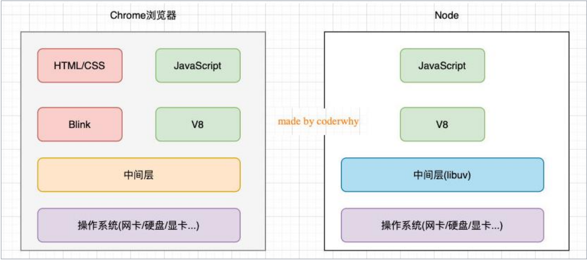
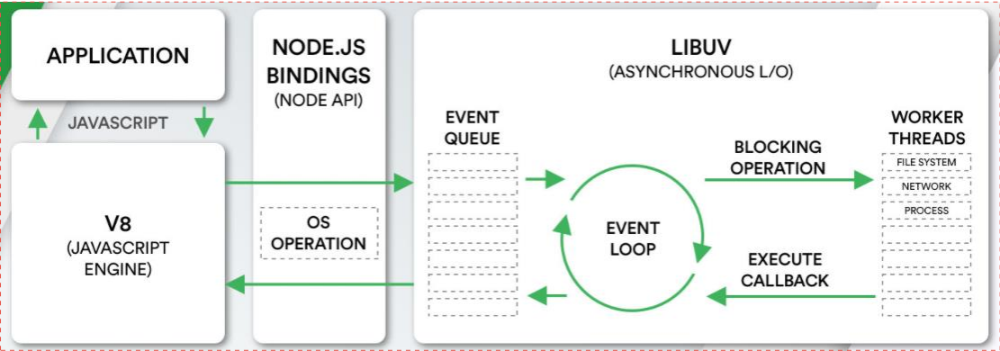
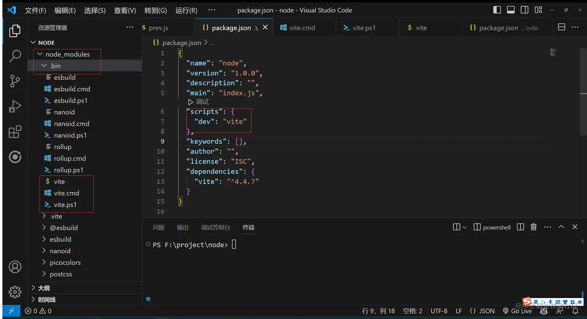

# node学习笔记
## 第一部分：node简介
### Node.js是什么
一、**官方对Node.js的定义**：
* Node.js是一个基于**V8 JavaScript引擎**的JavaScript**运行时**环境。
* 也就是说Node.js基于V8引擎来执行JavaScript的代码，但是不仅仅只有V8引擎：
* 前面我们知道**V8可以嵌入到任何C ++应用程序中**，无论是Chrome还是Node.js，事实上都是嵌入了V8引擎来执行JavaScript代码；
* 但是在Chrome浏览器中，还需要解析、渲染HTML、CSS等相关渲染引擎(Blink渲染引擎)，另外还需要提供支持浏览器操作的API、浏览器自己的事件循环等；
* 另外，在Node.js中我们也需要进行一些额外的操作，比如文件系统读/写、网络IO、加密、压缩解压文件等操作；
  ### 浏览器和Node的差别
* 差别架构图如下

* Node.js详细架构图如下：
   * 我们编写的Javascript代码会经过V8引擎，在通过Node.js的Bindings,再放到Libuv的事件循环中
   * **libuv**是用C语言编写的，是node中实现跨平台等其他操作系统层的重要平台
   * libuv提供了事件循环、文件系统读写、网络I/O、线程池等内容

  
### Node.js前言---commonJs规范(个人总结理解)
* node是commonjs模块化规范的最好体现，因为node里面是**直接内置支持commonjs**的，就是支持export或module.exports={}和require（），那么他们实现模块化的本质其实就是**对象的引用赋值**的过程，因为exports导出的是一个对象，而require函数导入的就是这个**对象的引用地址**。
* node中实际是module.exports的导出（也就是node提出的），exports.xxxx其实是commonjs中的规范（但node为了实现cjs的规范也实现了这种方式），但是在node中也能导出但一般不用。
* 在node中require引入过程中，引入的模块代码会**被执行一次**，多次引用不会重复执行，存在循环引用时候用的是深度优先算法，(本人对该算法的一理解：一路走到底)。
**补充** ：require的查找规则有很多种，根据你传入的路径来解析查找，（传入的是./会解析为文件路劲，或者传入‘fs’,当做内置模块去查找），esmodule是 es6提出来的规范，相当于js内置了这种规范，但是要浏览器支持，export defult是默认导出，一个模块只能有一个，es2022还加入了一个新特性，**import.meta**项目中常见的用法(import.meta.url)记录了当前模块的元信息
## 第二部分，npm工具介绍以及原理
### npm简介
* npm（全称 Node Package Manager）是 Node.js 的包管理工具，它是一个基于命令行的工具，用于帮助开发者在自己的项目中安装、升级、移除和管理依赖项。
* [npm官网](https://www.npmjs.com/)
  * 类似于 PHP 的工具：Composer。它是 PHP 的包管理器，可以用于下载、安装和管理 PHP 的依赖项，类似于 npm。
  * 类似于 Java 的工具：Maven。它是 Java 的构建工具和项目管理工具，可以自动化构建、测试和部署 Java 应用程序，类似于 npm 和 webpack 的功能。
  * 类似于 Python 的工具：pip。它是 Python 的包管理器，可以用于安装和管理 Python 的依赖项，类似于 npm。
  * 类似于 Rust 的工具：Cargo。它是 Rust 的包管理器和构建工具，可以用于下载、编译和管理 Rust 的依赖项，类似于 npm 和 Maven 的功能。
  ### npm常用命令
::: info npm常用命令
1. npm init：初始化一个新的 npm 项目，创建 package.json 文件。
2. npm install：安装一个包或一组包，并且会在当前目录存放一个node_modules。
3. npm install (package-name) --save：安装指定的包，并将其添加到 package.json 文件中的依赖列表中。
4. npm update (package-name)：更新指定的包。
5. npm uninstall (package-name)：卸载指定的包。
6. 6.npm run (script-name)：执行 package.json 文件中定义的脚本命令。
7. npm info (package-name)：查看指定包的详细信息。
8. npm list：列出当前项目中安装的所有包。
9. npm outdated：列出当前项目中需要更新的包。
10. npm publish：发布自己开发的包到 npm 库中。
11. npm publish：发布自己开发的包到 npm 库中。
12. pm config list 用于列出所有的 npm 配置信息。执行该命令可以查看当前系统和用户级别的所有 npm 配置信息，以及当前项目的配置信息（如果在项目目录下执行该命令）
13. npm get registry 用于获取当前 npm 配置中的 registry 配置项的值。registry 配置项用于指定 npm 包的下载地址，如果未指定，则默认使用 npm 官方的包注册表地址
14. npm set registry npm config set registry (registry-url) 命令，将 registry 配置项的值修改为指定的 (registry-url) 地址
:::
### npm install的原理
::: details 点击展开查看
* npm install采用的扁平式安装形式，会把所有的依赖项全部平铺在node_modules目录下面
* 先简单阐述npm install 的过程
  1. 首先会逐级去寻找npm的配置文件，是一个命名为.npmrc的配置文件，寻找路劲:项目根目录-用户级目录-全局根目录-npm安装的内置目录
  2. 检查项目根目录有没有package.json文件
  3. 对比package.json和package.lock.json文件，版本不一致根据package,json的版本号去下载依赖包并同时更新package.lock.json文件
  4. 检查npm依赖包缓存，如果有缓存直接解压进node_modules文件夹，没有缓存去根据配置文件下载源路径下载依赖包
  5. * 
:::

### npm run的原理
  1.根据package.json文件的可执行文件名字到项目级的node_modules目录下的.bin文件下执行对应的脚本
  2.寻找node_modules也是逐级寻找的
  3.假如都没有找到就会报错



> 因为nodejs 是跨平台的所以可执行命令兼容各个平台

- .sh文件是给Linux unix Macos 使用
- .cmd 给windows的cmd使用
- .ps1 给windows的powerShell 使用
**备注**：npm 也是有生命周期的，如下：
```javascript
    "predev": "node prev.js",
    "dev": "node index.js",
    "postdev": "node post.js"
```
predev再执行dev之前会自动执行，postdev会在dev之后执行
### npx
* npx是npm5.2版本以后内置的一个工具
* 它允许**用户在不安装全局包**的情况下，运行已安装在**本地项目中的包或者远程仓库中的包**。
* npx的作用是在命令行中运行node包中的可执行文件，而不需要全局安装这些包。
* 这可以使开发人员更轻松地管理包的依赖关系，并且可以避免全局污染的问题。它还可以帮助开发人员在项目中使用不同版本的包，而不会出现版本冲突的问题。
### node中支持的模块化规范
* 其实node默认是commonjs，但是也可是是ESmodule
* 需要再package.json中指定type字段
* 假如指定ESmodeuls，就不能使用cjs,相应的有部分API也不能使用，例如__dirname和__filename
* **CJS是基于运行时的同步加载(不支持tree shrking)，esm是基于编译时的异步加载**