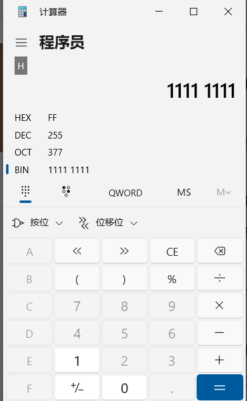
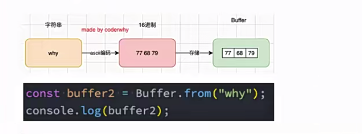
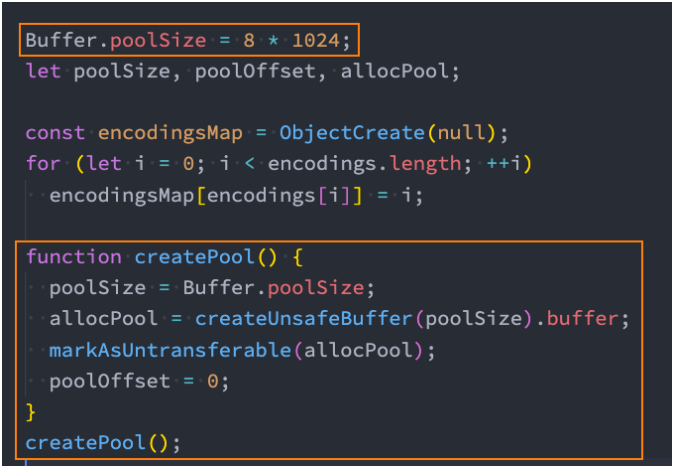
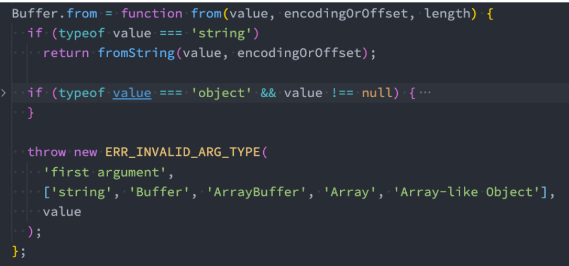
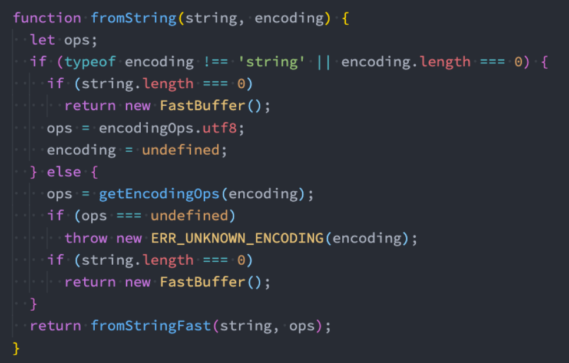

# NodeJS内置模块之buffer
### 一、数据的二进制
1. 计算机中所有的内容：文字、数字、图片、音频、视频最终都是以二进制的形式存储在计算机中
2. JavaScript可以直接处理非常直观的数据：比如字符串，就是纯文本，大多数也是通过这种文本来展示给用户
3. 在前端领域，我们看到的图片或者视频并不是js在处理，而是浏览器根据我们指定的src地址去下载图片进行渲染的，其实在前端处理二进制数据我们接触过，就是前端上传文件，然后通过blob对象来存储二进制数据；
**对于服务器来说：**，服务器要处理的文件类型就会有很多
1. 比如某一个保存文本的文件使用 utf-8进行编码的，那么我们必须读取到他们的二进制数据，再通过utf-8转换成对应的文字；
2. 比如我们需要读取的是一张图片数据（二进制），再通过某些手段对图片数据进行二次的处理（裁剪、格式转换、旋转、添加滤镜），Node中有一个Sharp的库，就是读取图片或者传入图片的Buffer对其再进行处理；
3. 比如在Node中通过TCP建立长连接，TCP传输的是字节流，我们需要将数据转成字节再进行传入，并且需要知道传输字节的大小（客户端需要根据大小来判断读取多少内容）；
### 二、Buffer和二进制
1. 对于服务端而言，需要做更多的功能，就需要直接去操作某一个文件的二进制数据
2. 因此，NodeJs中给我提供了一个类(Buffer)，而且是全局的
3. Buffer的定义:就是用来存储二进制数据的一个数组
4. **bufeer中的每一项代表的是8位二进制**
##### 为什么是8位？
   * 在计算机，一位二进制保存的数据非常有限，一般都不会直接操作一位

   * 所以通常将8位合在一起作为一个储存单元，这个单元称之为**一个字节(byte)**

   * 也就是我们常说的**1byte=8bit**,**1kb=1024byte**

   * 例如很多编程语言中，int类型是4个字节，long类型是8个字节

   * 例如RGB(255,255,255),是因为，R、G、B都是用一个字节来表示，而一个字节最大为1111,1111，8位1转换为10进制就是255，最大就是255
    **注:因此我们计算机不管表什么内容都是以字节为单位来计量，而Buffer就是用来操作二进制的一个容器，buffer数组中每一个表示的也是一个字节(8为二进制)**	

   * 

   * BIN-二进制

   * OCT-八进制

   * DEC-十进制

   * HEX-16进制

   * 因此，在计算机中，一个字节能表示的最大数字是255,能表示的数字范围是0~255

   * 在buffer中，表示二进制数据通常用的是16进制，例如:一个buffer数组[1111 1111]，这表示一个字节的buffer数组，但是在Node中，他是这样表示的[FF],也就是它会把一个字节的前四位和后四位分别转为16进制来表示，有点绕，多读两遍！！！

     ### Buffer和字符串
```javascript
//创建一个buffer
const buf = Buffer.from('hello')
console.log(buf)//<Buffer 68 65 6c 6c 6f>
//当我们使用buffer来存储hello的时候，计算机会把hello根据ACSII的
//编码方式转换成对应的二进制存储到计算机，而buffer里面表示取的是16进制的形式
//可自行查阅ASCII码对照表检查


//创建buffer--字符串带中文
const buf2 = Buffer.from('你好')
console.log(buf2)//<Buffer e4 bd a0 e5 a5 bd>
//对于中文--默认使用utf-8的编码方式，一个中文字符需要使用三个字节来表示才可以(包括中文状态下的符号)
//因此前三个16进制的字节表示‘你’,后三个表示‘好’
//注意:并不是所有中文字符都是用三个字节就可以表示完的,复杂的需要四个字节

//可以调用toString()来解码
console.log(buf2.toString())//'你好'
```



**buffer编码和解码指定编码方式**
```javascript
//创建buffer---携带编码方式
const buf3 = Buffer.from('你好', 'utf16le')//指定编码格式
const buf4 = Buffer.from('你好', 'utf-8')//默认就是这个utf-8
console.log(buf3, buf4)//<Buffer 60 4f 7d 59> <Buffer e4 bd a0 e5 a5 bd>
console.log(buf3.toString('utf16le'))//解码也需要指定格式,默认utf-8
//注意:如果编码和解码使用的方式不一样，那么就会出现乱码
```
#### 三、buffer的其他创建方式
* [Buffer的相关API官网](https://nodejs.org/docs/latest-v18.x/api/buffer.html)
* buffer.alloc()--创建一个指定长度的buffer数组--申请内存
```javaScript
//通过alloc创建buffer
const buf1 = Buffer.alloc(1, 'h', 'utf-8')//创建**一个字节**长度的buffer数组
//当创建的buffer数组长度不够存储传入的字符的时候就会出现乱码
console.log(buf1)//<Buffer 68>

//也可以创建一个指定长度的buffer对象
const buf2 = Buffer.alloc(8)
console.log(buf2)//<Buffer 00 00 00 00 00 00 00 00>,此时buffer每一个字节都是空的
//手动访问buffer中的每一项
console.log(buf2[0])//0--访问的时候他是把十六机制转换成了十进制给我输出的

//手动设置buffer中的每一项
buf2[0] = 100
console.log(buf2)//<Buffer 64 00 00 00 00 00 00 00>
//他会把它先转为16进制在存进去,如果你赋值的是一个16进制，那么就不再转化
```
#### 四、NodeJs中读取文件或者图片的二进制数据
* 1、上一章讲过通过fs读取文件时，不指定解码格式，那么返回的就是一个buffer数组
```javaScript
const fs = require('node:fs')
//test.txt的内容为:今天是周一,太棒了
fs.readFile('./test.txt', (err, data) => {
  if (err) return
  console.log(data)//<Buffer e4 bb 8a e5 a4 a9 e6 98 af e5 91 a8 e4 b8 80 2c e5 a4 aa e6 a3 92 e4 ba 86>
})

//读取图片的二进制--后期会讲到一个(sharp)的一个库，用于处理图片buffer
fs.readFile('./01.jpg', (err, data) => {
  if (err) return;
  //返回就是这张图片对应的buffer数组--二进制数据
  console.log(data)//<Buffer ff d8 ff e1 a3 f0 02 04 00 ... 3853408 more bytes>
})
```
#### 五、Buffer底层原理知识
* 在node源码中，其实做了一个性能优化，就是在我们创建buffer的时候，它默认第一次是会申请一个8*1024大小的内存空间，而不是我们频繁创建就频繁去向操作系统申请的

* 源码如下：

* 

* 我们通过Buffer.from('Hello')，创建buffer时候会调用createPool(),默认会申请8kb大小的内存

* BUffer.from（）源码：

  

* 就是判断一下传入的类型，如果字符串就会执行fromString():

  

* 然后在调用fromStringFast()，这个方法大致就是判断一下创建的字符串长度能不能在剩余的长度填充，可以就直接返回
* 如果不够就调用createPool()申请空间
* 注:加入传入的大于8*1024 >>> 1 ,也就是4kb就直接创建传入大小的buffer，直接向操作系统申请，而不会用第一次申请的8kb来填充
